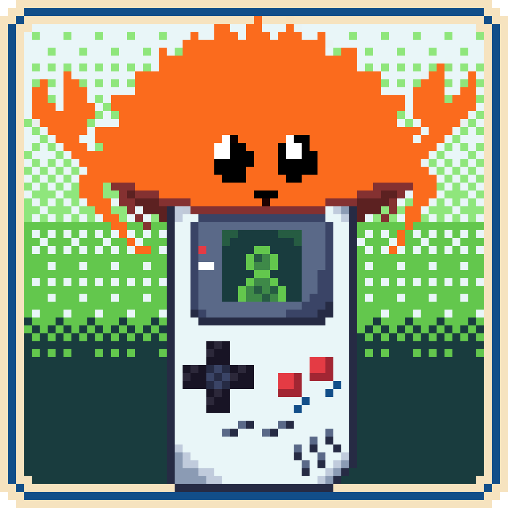

<p align="center">
    
    <h1 align="center">DMGTile</h1>
</p>

<p align="center">
    
    
    
    
    
    
    <br />
    A Gameboy Tile Editor build in Rust
</p>

---

## Table of Content
- [Table of Content](#table-of-content)
- [Why DMGTile even exist ( °ヮ° ) ?](#why-dmgtile-even-exist--ヮ--)
- [Core Features ( ദ്ദി ˙ᗜ˙ )](#core-features--ദ്ദി-ᗜ-)
  - [Editor](#editor)
  - [Project Management](#project-management)
- [Export](#export)
- [Built with...](#built-with)
- [Installation \& Quick Start](#installation--quick-start)
- [Stardance Devlogs ᕙ( •̀ ᗜ •́ )ᕗ](#stardance-devlogs-ᕙ-̀-ᗜ-́-ᕗ)
- [Developement](#developement)
  - [Depedencies](#depedencies)
  - [Building DMGTile from source](#building-dmgtile-from-source)
  - [Cross-compiling](#cross-compiling)
- [Boring Stuff](#boring-stuff)
  - [Use of AI](#use-of-ai)
  - [Credits](#credits)
  - [License](#license)


<!-- TODO: screenshot -->

## Why DMGTile even exist ( °ヮ° ) ?

The idea for this project came from [GBTD (Gameboy Tile Designer)](https://www.devrs.com/gb/hmgd/gbtd.html), who is Windows only and kinda old... So I recreated it from-scratch in Rust, so it can run on Linux, Windows & macOS without [Wine](https://www.winehq.org) (or equivalent). And all of this with the same features as [GBTD](https://www.devrs.com/gb/hmgd/gbtd.html).

## Core Features ( ദ്ദി ˙ᗜ˙ )

### Editor

* **Pixel Painting**: Use the mouse to paint ദ്ദി(˵ •̀ ᴗ - ˵ ) ✧
* **Bucket Fill**: A classic flood-fill tool
* **Transform Tools**: You can flip, rotate, move the active tile
* **Live Previews**: A little 4x4 grid to preview the active tile in a pattern (e.g: a background)
* **Cached Texture Rendering**: Tile textures are cached and only rebuilt when a tile is modified

### Project Management

* **Multi-Tile Support**: You can draw up to 128 tiles per project file (you can scroll the list on the right of the screen to change tile)
* **Undo/Redo**: Each action is store in a stack, so you are able to undo or redo an action !
* **Copy/Paste/Cut**: Duplicate or move tile data between slots (in the same project)
* **File Format**: Each project is saved in `.dmgtile` (JSON), storing only the modified tiles while preseving the tiles ID
* **Keyboard Shortcut**: Full Cmd/Ctrl support for New Project, Open, Save, Undo, Redo, etc... Even the tools have there own shortcut

## Export

* **`.bin` Export**: Exports all the modified tiles into the Gameboy's native 2bpp format
* **`.c` Export**: Exports all the modified tiles as a C array, with configurable array name (Can be used with [GBDK](https://gbdk.org))
* **Selective export**: Only the modified tiles are written out

## Built with...

This project was built to help me learn Rust while creating a usefull Application. Here is what I have used:

* [Rust](https://rust-lang.org/): for the whole app! `ദ്ദി(˵ •̀ ᴗ - ˵ ) ✧`
* [`eframe` / `egui`](https://github.com/emilk/egui): for the cross-platform UI
* [`serde`](https://serde.rs/) + [`serde_json`](https://docs.rs/serde_json/): for the `.dmgtile` file
* [`rfd`](https://github.com/PolyMeilex/rfd): for native file dialogs

## Installation & Quick Start

The easiest way to download DMGTile is to go to the [Github Release]() and get the latest version `( ദ്ദി ˙ᗜ˙ )`. (Otherwise you can build the project from source on your own here: [Developement](#developement))

1. Launch DMGTile, use `File > New` (or `Cmd/Ctrl+N`) to start the project
2. Select a tile from the tile list. And then paint !
3. `File > Export As` to write out `.bin` or `.c` for your game !

`ദ്ദി(˵ •̀ ᴗ - ˵ ) ✧`

## Stardance Devlogs ᕙ( •̀ ᗜ •́ )ᕗ

On [Stardance](https://stardance.hackclub.com/) you can watch the full development process via all the devlogs I've created here: [DMGTile Devlogs](https://stardance.hackclub.com/projects/54773)

## Developement

> [!IMPORTANT]
> You must have [Rust](https://rust-lang.org/) and [Cargo](https://doc.rust-lang.org/cargo/) installed on your computer

### Depedencies

* [`eframe` / `egui`](https://github.com/emilk/egui)
* [`serde`](https://serde.rs/) / [`serde_json`](https://docs.rs/serde_json/)
* [`rfd`](https://github.com/PolyMeilex/rfd)

### Building DMGTile from source

* Clone the repository with

```bash
git clone https://github.com/wirenux/DMGTile.git
cd DMGTile
```

* Then build and run with:

```bash
cargo run
```

### Cross-compiling

DMGTile ships a `Makefile` using [`cross`](https://github.com/cross-rs/cross) to build for Windows and Linux from macOS:

```bash
make windows
make linux
make mac-intel
make # this is the one for M-series mac
```

## Boring Stuff

### Use of AI

* Brainstorming + README.md idea
* Help with build method

### Credits

This project is created by [@wirenux](https://github.com/wirenux) in [Rust](https://rust-lang.org/), using [egui](https://github.com/emilk/egui).


Logo by [@wirenux](https://github.com/wirenux)

### License

This project is released under the [MIT License](./LICENSE)